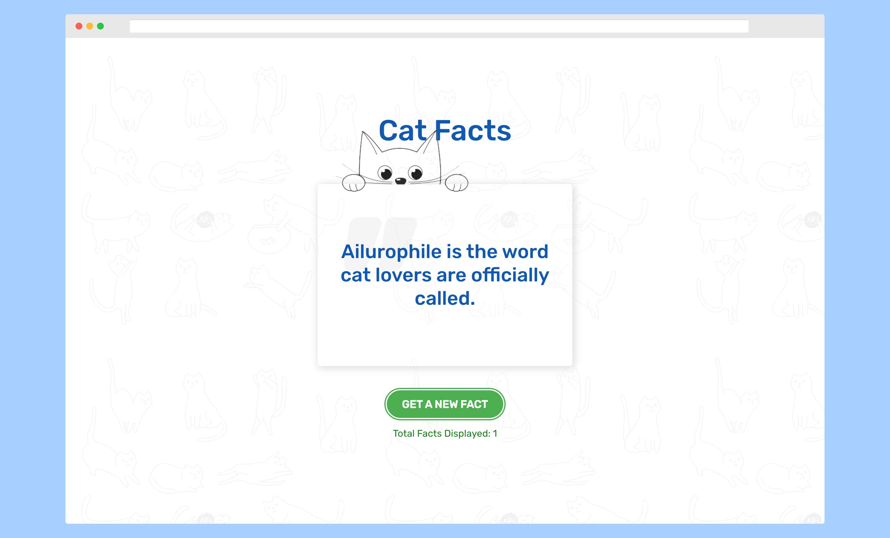
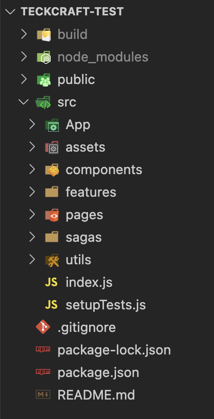

# Cat Facts App
Displays a random fact about cats from [catfact public API](https://catfact.ninja/) \
Uses a global state created using Redux Saga.

###  
[ View Live Demo](https://teckcraft-catfacts.netlify.app/)

###  
[ View Live Demo](https://teckcraft-catfacts.netlify.app/)

## Setup/installation instructions

1. Clone the project repository or [download the source](https://github.com/rabinkaspal/teckcraft-test/archive/refs/heads/main.zip) code and extract.
2. Open project folder in terminal and run `npm install` to install dependencies
3. Once finished, run `npm start` to run the project.
4. To run tests, run `npm test` command.
5. `npm run build` command will build a production ready build which will be available in `./build` folder

## Description

The project is built using ReactJS using Javascript and Styled Components for styling. Axios library for fetching api data and Redux Toolkit and Redux Saga for state management. Testing uses Jest and React Testing Library.

Special Library used are [`core-js`](https://www.npmjs.com/package/core-js) and [`regenerator-runtime`](https://www.npmjs.com/package/regenerator-runtime)

### Project Structure

Since it was a simple project, the project structure is kept as simple as possible. The `App` folder contains the App component. UIs are grouped under `pages` folder while logic and functions along with reducer functions are grouped under `features`. Each UI components are placed under `components` folder under which each folder consists of a `index.js` for the component and a `Styles.js` for styling the specific component. The `asset` folder contains local images, `saga` for redux saga while `utils` encloses utility functions

Errors that may occur while fetching facts from api are handled using `try...catch` block. A user-readable message is shown using `react-toastify` while making sure the app doesn't crash.

For testing, individual components, reducers and sagas are tested using Jest and React Testing Library.

#### Resources:

Redux Saga: [Redux Toolkit with Redux Saga](https://www.youtube.com/watch?v=9MMSRn5NoFY&t=945s)

Testing: [Unit Testing Redux with Redux Sagas](https://montecha.com/blog/unit-testing-redux-with-redux-sagas/) | [Testing Library Docs](https://testing-library.com/docs/) | [React Testing Youtube Playlist](https://www.youtube.com/watch?v=TBZy-Rc-xX0&list=PL4cUxeGkcC9gm4_-5UsNmLqMosM-dzuvQ)

## Assumptions

Since it was a very simple app, I took the liberty to make my own UI and kept it as simple and elegant as I could. The assumptions I made regarding the app were:

- It is a single page application and no routing is necessary. Although to prevent accidental 404, I have added a `Not Found` page with a link to go back to the main page.

- The page will load the first fact as soon as it loads. User can then fetch new fact using the button.

- Page responsiveness is not very crucial. But minimum effort should be displayed.

  

### Tell us what you thought of the test and how long it took you to complete
This was a very interesting project. While we were busy trying to build larger projects, attempting this project has provided an opportunity to focus on smaller things and remind how important those things are. Overall, it has been a good exercise doing this one. 

Initially, I thought it would take me over 2 days to complete this as I have very little experience with testing. Also, while I was familiar with React Redux and Redux Toolkit, Redux Saga is a new topic for me (but is in my agendas to learn eventually). But after referring to few articles online, I could complete th UI and functionality within under 4 hours. The next few hours were devoted to testing the app which also took significant amount of time relative to the actual project.

### Tell us what else you would have added to the code if you had more time
More tests could be added. As I am very new to testing, it took me longer to find errors and fix them while there are still errors I couldn't fix. As a result of which components aren't tested to the fullest.

## Closing Notes
I hope my efforts to complete this project are just enough to take me to the next step of the hiring process. Although I am switching careers(previously Mobile Application Developer with Java, and small Web Developers roles), my passion for frontend, UI design and User Experience has always kept me striving for learnig more things frontend. My quest of learning and increasing my knowledge base is still going on and I hope I will be served well.

I hope to hear from you soon. Hopefully, good news entails.
